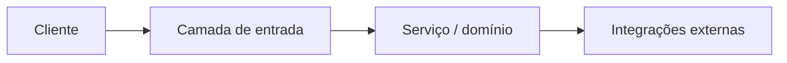

# Design: {titulo}

> Spec: [spec.md](../spec.md) · Issue: PROJ-XXXX

## Visão geral

<!-- Diagrama ou parágrafo da solução de ponta a ponta -->

## Fluxo de aprovação (Specify)

Aprovação **incremental** com o dev durante `/sdd-03-specify`. Não avançar para `/sdd-04-plan` com `design.md` incompleto ou não aprovado.

| Bloco | Conteúdo | Aprovado pelo dev |
|-------|----------|-------------------|
| 1 | Visão geral + Arquitetura | [ ] Sim — data: |
| 2 | Componentes + Reutilização | [ ] Sim — data: |
| 3 | Decisões técnicas + Riscos | [ ] Sim — data: |

Registrar aprovações no chat; opcional: uma linha em `executions.md` na fase Specify.

Abordagens: preferir a tabela em `spec.md` §2; só duplicar aqui se a da spec for insuficiente.

## Arquitetura

## Componentes

| Componente | Responsabilidade | Novo/Existente |
|------------|------------------|----------------|
| | | |

## Reutilização

<!-- O que reaproveitar do código atual (classes, utils, padrões) -->

## Decisões técnicas

| ID | Decisão | Contexto | Consequências |
|----|---------|----------|---------------|
| D1 | | | |

## Riscos e mitigação

| Risco | Impacto | Mitigação |
|-------|---------|-----------|
| | | |

## Fora de escopo (reforço)

Ver **non-goals** em `spec.md`.

## Restrições (reforço)

Ver **Restrições** em `spec.md` §2 To Be, [sdd-restricoes.md](../templates/sdd-restricoes.md) e [AGENTS.md](../../AGENTS.md). Decisões técnicas não podem violá-las.
